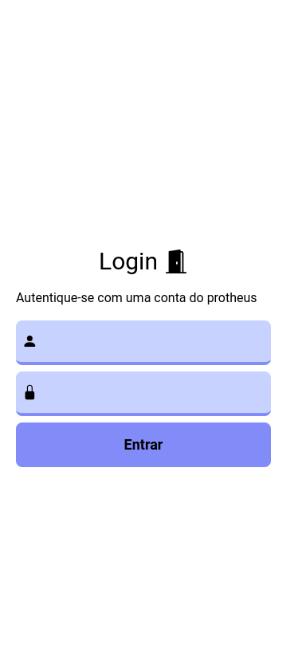
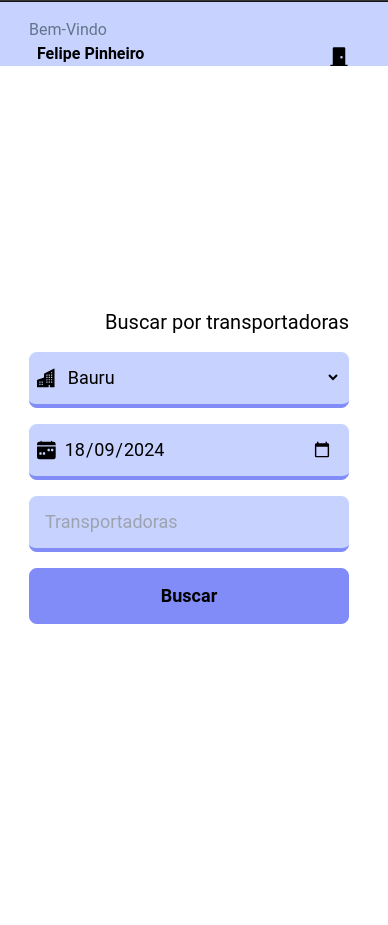
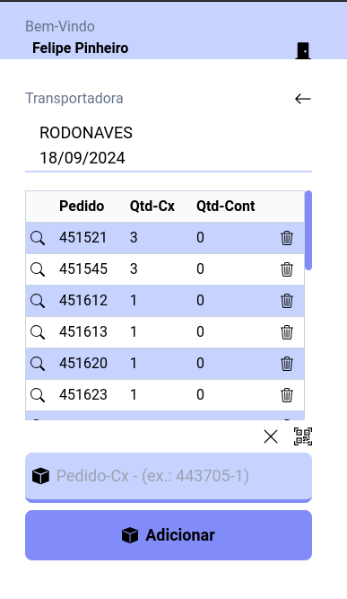
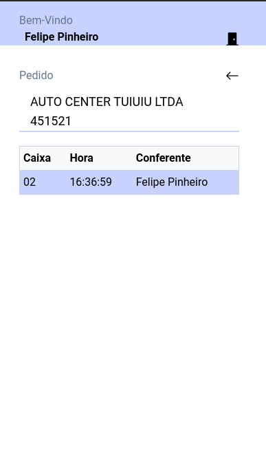

    

<h1 align="center"">App beep patral</h1>

Desenvolvido com Vite + React.js, é uma aplicação para gerenciar as caixas dos pedidos que as transportadoras coletam no dia a dia.

<h2>Regras de negócio</h2>

- Apenas usuários com uma conta no protheus podem acessar

<h2>Requisitos funcionais</h2>

- Um usuário deve poder se autenticar na aplicação
- Um usuário deve poder escolher a data, transportadora, filial para ver os pedidos
- Um usuário deve poder beepar uma caixa manualmente, ou com um scanner de qr
- Um usuário deve poder vizualizar detalhes de cada pedido
- Um usuário deve poder excluir as caixas que beepou errado

<h2>Requisitos não funcionais</h2>

- A aplicação deve ser fácil de usar
- A aplicação deve suportar usuários simultaneos
- A aplicação deve ser fácil de realizar manutenções no código e implementações de features novas
- A aplicação deve ser segura

<h2>Tecnologias</h2>

- [React.js](https://react.dev/)
- [html5 qrcode](https://scanapp.org/html5-qrcode-docs/docs/apis)
- [Clique aqui para ver mais](https://github.com/FelipePinheiroRegina/beep-box-react/blob/main/package.json)

<h2>Telas da aplicação</h2>

| Imagem | Imagem |
|--------|--------|
|||
|||

<h2>Detalhes sobre a aplicação</h2>

A aplicação realiza operações cruds completas, ela consome dados da API rest integrada com o protheus (sistema que a patral usa)

<h2 align='center'>Deploy</h2>

O projeto roda em uma Vm Windows server na patral, as configurações de apache foram feitas via `bash`

<h2 align='center'>Desenvolvedor</h2>

<strong>Felipe Pinheiro Regina</strong>

[LinkedIn](https://www.linkedin.com/in/felipe-pinheiro-002427250/)

